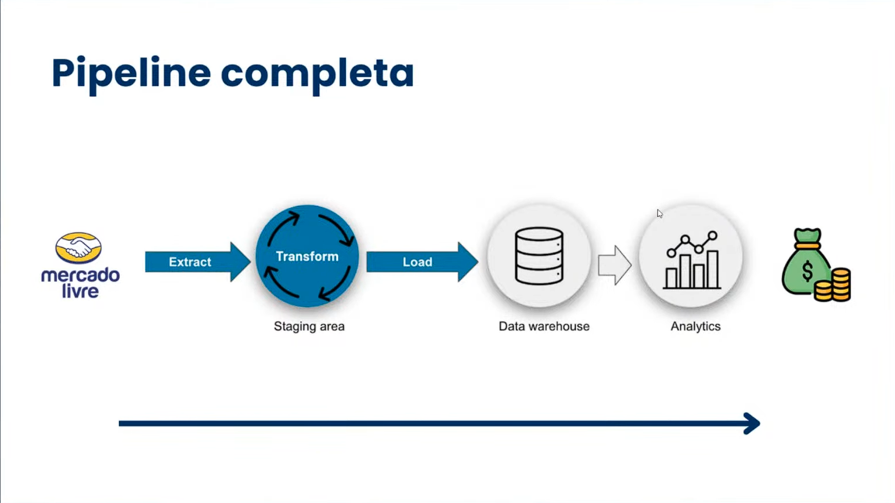
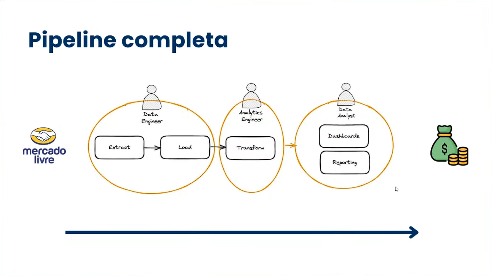

## Contextualização
Fomos contratados por uma grande empresa para azer uma pesquisa de mercado na categoria de tênis esportivos dentro do mercado livre.
O objetivo dessa empresa é avaliar:
- Quais marcas são mais encontradas até a pagina 10
- Qual o preço médio por marca
- Qual a satisfação por marca

Para montar a sua estrategia de pricing e marketing, a empresa precisa dessas informações para tomar decisões mais assertivas.

URL: https://lista.mercadolivre.com.br/tenis-corrida-masculino

---




---

## Tecnologias Utilizadas
- Python
- Scrapy
- Pandas
- Sql
- Streamlit
- dontenv

## Como começar o projeto
```bash	
scrapy startproject mercado_livre
cd mercado_livre
```

```bash
scrapy genspider mercado_livre_spider https://lista.mercadolivre.com.br/tenis-corrida-masculino
```

## Etapas que o scrapy faz
1. requests - Faz a requisição da página
2. parse - Pega as informações da página
3. next_page - Pega a próxima página

## Terminal do Scrapy
```bash
scrapy shell
```

## Comandos do Scrapy
```bash
fetch('https://lista.mercadolivre.com.br/tenis-corrida-masculino')
```

Normalmente sites como o mercado livre tem proteção contra scraping e deixa apenas agentes(navegador) específicos acessarem o site. Para resolver isso, basta adicionar o user-agent no header da requisição, ou seja, vamos fingir que somos um agente específico utilizando o user-agent do google no scrapy.

Para isso, você deve procurar o user-agent do google e adicionar no header da requisição. Procure por "my user agent" no google e copie o user-agent do google e então adicione nas variáveis de ambiente, no .env do projeto.

```bash
USER_AGENT="adicione o user-agent do google aqui"
```

Depois, execute novamente o comando fetch e veja se a página foi carregada corretamente.

```bash
fetch('https://lista.mercadolivre.com.br/tenis-corrida-masculino')
```
Esse comando vai fazer a requisição da página e vai retornar o status da requisição, se foi 200, significa que a página foi carregada corretamente.	

Para pegar o html da página e ter certeza que a página foi carregada corretamente, execute o comando abaixo.

```bash
response.text
```
---

## Observações
removi o middleware pois não vou trabalhar com proxy nessa aplicação de aprendizado, bem como, também removi a pipeline pois vou trabalhar com o pandas para salvar os dados.

---

## Parse
```bash
len(response.css('div.poly-card__content'))
```
esse comando vai retornar a quantidade de produtos que tem na página, que foi um total de 54 produtos.

vamos armazenar o meu response especefico em uma váriavel products.

```bash
products = response.css('div.poly-card__content')
```

Agora, vamos pegar apenas um produto para ver se está funcionando, vamos listar pela marca que está no css.
    
```bash
products.css('span.poly-component__brand').get()
```
com esse comando, vamos obter um retorno parecido com esse:

```html
<span class="poly-component__brand">OLYMPIKUS</span>
```

mas eu quero apenas o texto, então vamos adicionar o ::text no final do comando.

```bash
products.css('span.poly-component__brand::text').get()
```

com esse comando, vamos obter um retorno parecido com esse:

```html
'OLYMPIKUS'
```

Tudo isso foi apenas para entender como funciona o parse, agora vamos fazer isso diretamente no código, vamos modificar o nosso "../Pipeline-ETL-Python/mercado_livre/mercado_livre/spiders/mercado_livre_spider.py" para fazer o parse.
    
```python
import scrapy


class MercadoLivreSpiderSpider(scrapy.Spider):
    name = "mercado_livre_spider"
    allowed_domains = ["lista.mercadolivre.com.br"]
    start_urls = ["https://lista.mercadolivre.com.br/tenis-corrida-masculino"]

    def parse(self, response):
        products = response.css('div.poly-card__content')
        
        for product in products:
            
            yield {
                'marca': product.css('span.poly-component__brand::text').get()
            }
```

Agora vamos executar o código e ver se está funcionando e logo depois, armazenar os dados em um json, na raiz do projeto em uma pasta data

```bash
scrapy crawl mercado_livre_spider -o ../data/data.json
```

Com isso, vamos obter o seguinte resultado:
```json
[
{"marca": null},
{"marca": "ADIDAS"},
{"marca": "MIZUNO"},
{"marca": "MIZUNO"},
{"marca": "OLYMPIKUS"},
{"marca": "VANS"},
{"marca": "OLYMPIKUS"},
{"marca": "VANS"},
{"marca": "ABUZZE"},
{"marca": null},
{"marca": "OLYMPIKUS"},
{"marca": "MIZUNO"},
{"marca": "OLYMPIKUS"},
{"marca": "NIKE"},
{"marca": "OLYMPIKUS"},
{"marca": null},
{"marca": "ABUZZE"},
{"marca": "MIZUNO"},
{"marca": "MIZUNO"},
{"marca": "OLYMPIKUS"},
{"marca": "STARFLEX"},
{"marca": "MIZUNO"},
{"marca": "BOARDWALK"},
{"marca": null},
{"marca": "HOKA"},
{"marca": "NIKE"},
{"marca": null},
{"marca": "OLYMPIKUS"},
{"marca": "OLYMPIKUS"},
{"marca": "PUMA"},
{"marca": "OLYMPIKUS"},
{"marca": "MIZUNO"},
{"marca": null},
{"marca": null},
{"marca": null},
{"marca": "ASICS"},
{"marca": "ASICS"},
{"marca": null},
{"marca": null},
{"marca": "ASICS"},
{"marca": "KOLOSH"},
{"marca": "OLYMPIKUS"},
{"marca": "OLYMPIKUS"},
{"marca": "OLYMPIKUS"},
{"marca": null},
{"marca": "DM DAMANDO"},
{"marca": null},
{"marca": null},
{"marca": null},
{"marca": null},
{"marca": null},
{"marca": "FILA"},
{"marca": "PUMA"},
{"marca": "OLYMPIKUS"},
{"marca": "SKECHERS"},
{"marca": "SKECHERS"},
{"marca": "OLYMPIKUS"}
]
```

Os null, são os tenis que não tem uma marca.

---

## O que vamos fazer agora?

Para a gente continuar, vamos pegar além da marca,  o nome, preço antigo, preço atual, avaliação e a quantidade de avaliações.

Para isso, vamos analisar o html da página e ver onde estão essas informações, sendo essas:

- Marca: span.poly-component__brand
- nome: h2.poly-box poly-component__title
- preço antigo: s.andes-money-amount andes-money-amount--previous andes-money-amount--cents-comma
- preço atual: div.poly-price__current
- avaliação: span.poly-reviews__rating
- quantidade de avaliações: span.poly-reviews__total

com isso, vamos modificar o nosso código para pegar essas informações.

```python
import scrapy


class MercadoLivreSpiderSpider(scrapy.Spider):
    name = "mercado_livre_spider"
    allowed_domains = ["lista.mercadolivre.com.br"]
    start_urls = ["https://lista.mercadolivre.com.br/tenis-corrida-masculino"]

    def parse(self, response):
        products = response.css('div.poly-card__content')
        
        for product in products:
            
            prices = product.css('span.andes-money-amount__fraction::text').getall()
            cents = product.css('span.andes-money-amount__cents::text').getall()
                
            yield {
                'marca': product.css('span.poly-component__brand::text').get(),
                'nome': product.css('h2.poly-box.poly-component__title a::text').get(),
                'preco_antigo': prices[0] if len(prices) > 1 else None,
                'centavos_antigo': cents[0] if len(cents) > 1 else None,
                'preco_atual': prices[1] if len(prices) > 1 else None,
                'centavos_atual': cents[1] if len(cents) > 1 else None,
                'avaliacao': product.css('span.poly-reviews__rating::text').get(),
                'quantidade_avaliacoes': product.css('span.poly-reviews__total::text').get(),
            }
```

Com isso, já temos as informações que precisamos, agora vamos executar o código e já salvar em um json.

```bash
scrapy crawl mercado_livre_spider -o ../data/data.jsonl
```

---

Após isso, vamos fazer a configuração para pegar as 10 primeiras páginas, para isso, vamos modificar o nosso código para pegar a próxima página.

```python
import scrapy

class MercadoLivreSpiderSpider(scrapy.Spider):
    name = "mercado_livre_spider"
    allowed_domains = ["lista.mercadolivre.com.br"]
    start_urls = ["https://lista.mercadolivre.com.br/tenis-corrida-masculino"]
    page_count = 1
    max_page_count = 10

    def parse(self, response):
        products = response.css('div.poly-card__content')
        
        for product in products:
            prices = product.css('span.andes-money-amount__fraction::text').getall()
            cents = product.css('span.andes-money-amount__cents::text').getall()
                
            yield {
                'marca': product.css('span.poly-component__brand::text').get(),
                'nome': product.css('h2.poly-box.poly-component__title a::text').get(),
                'preco_antigo': prices[0] if len(prices) > 1 else None,
                'centavos_antigo': cents[0] if len(cents) > 1 else None,
                'preco_atual': prices[1] if len(prices) > 1 else None,
                'centavos_atual': cents[1] if len(cents) > 1 else None,
                'avaliacao': product.css('span.poly-reviews__rating::text').get(),
                'quantidade_avaliacoes': product.css('span.poly-reviews__total::text').get(),
            }
        
        if self.page_count < self.max_page_count:
            next_page = response.css('li.andes-pagination__button--next a::attr(href)').get()
            if next_page:
                self.page_count += 1
                print("Next page URL:", next_page)
                yield scrapy.Request(url=next_page, callback=self.parse)
```

Com isso, já temos a nossa aplicação pronta para pegar as 10 primeiras páginas.

#### Observação:
- Sites como mercado livre, tem regras para scraping, então, é importante que você respeite essas regras para não ser banido do site. Mas como aqui é um projeto de aprendizado, não tem problema, então vamos confgurar umas coias no nosso settings.py do scrapy.

```python
# Obey robots.txt rules
ROBOTSTXT_OBEY = False
```

vamos definir como False para não obedecer as regras do robots.txt, que é um arquivo que os sites colocam para dizer o que pode ou não ser feito no site.

---


